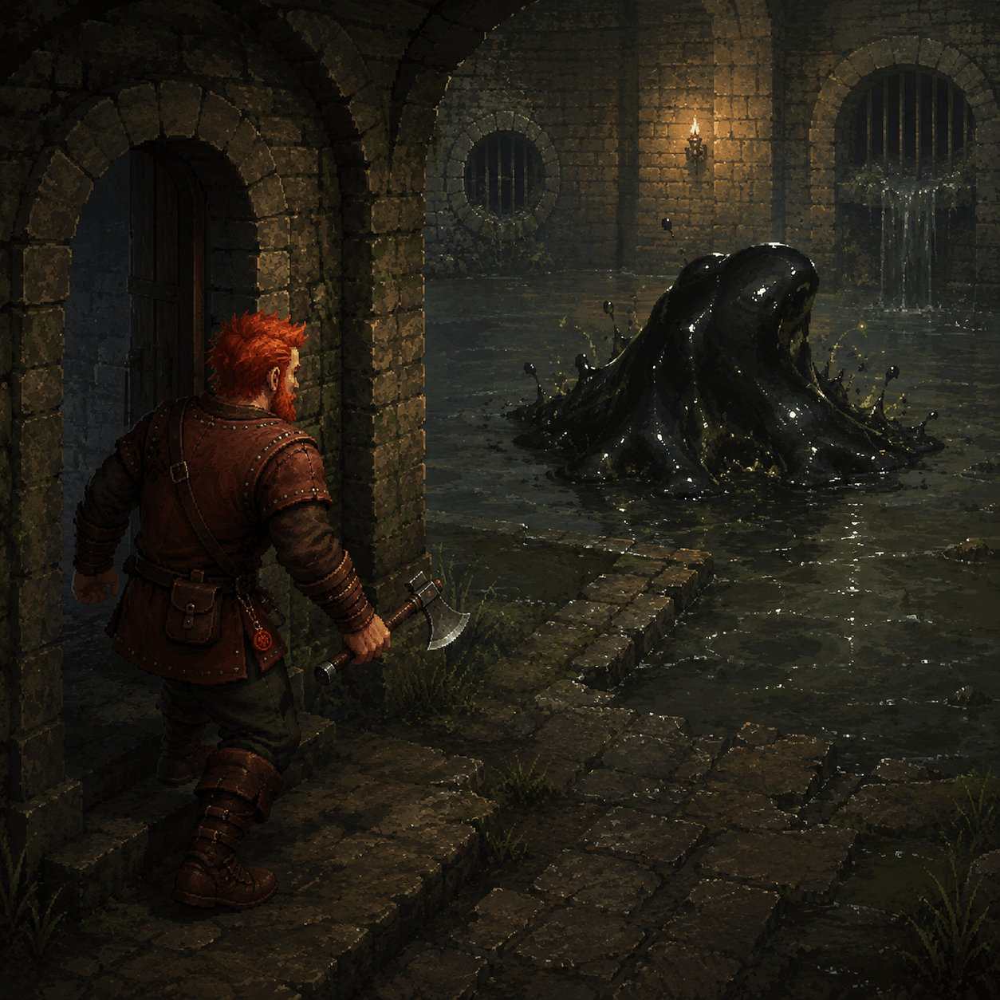
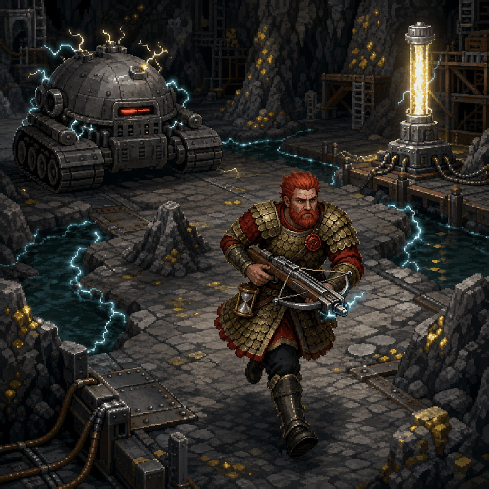
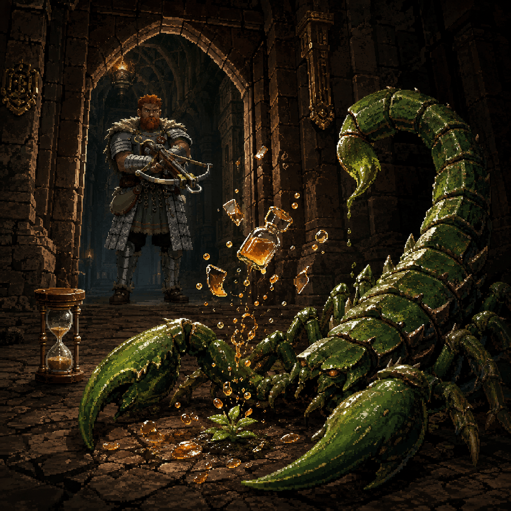
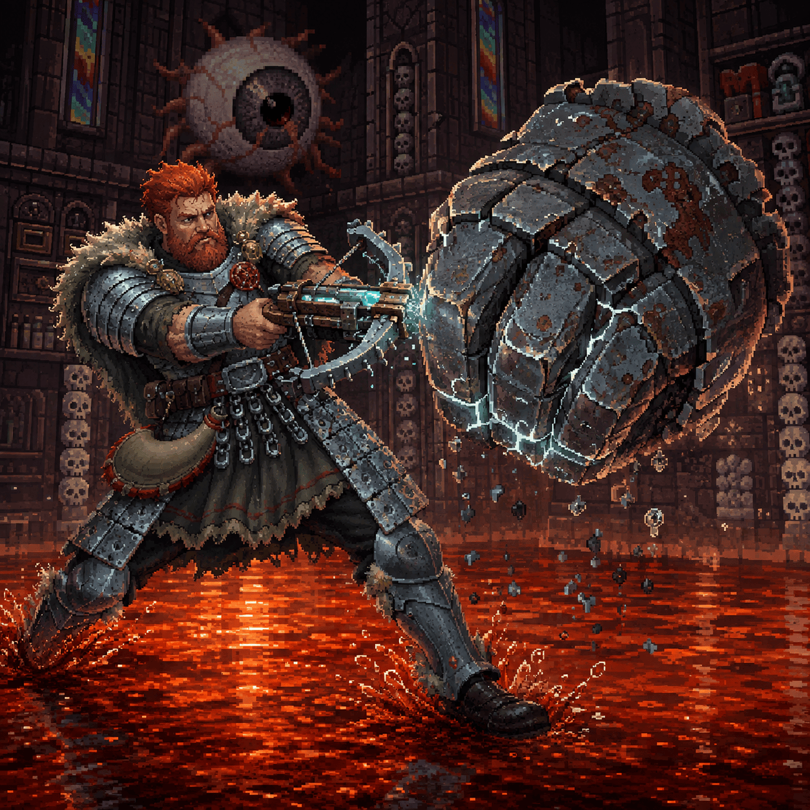
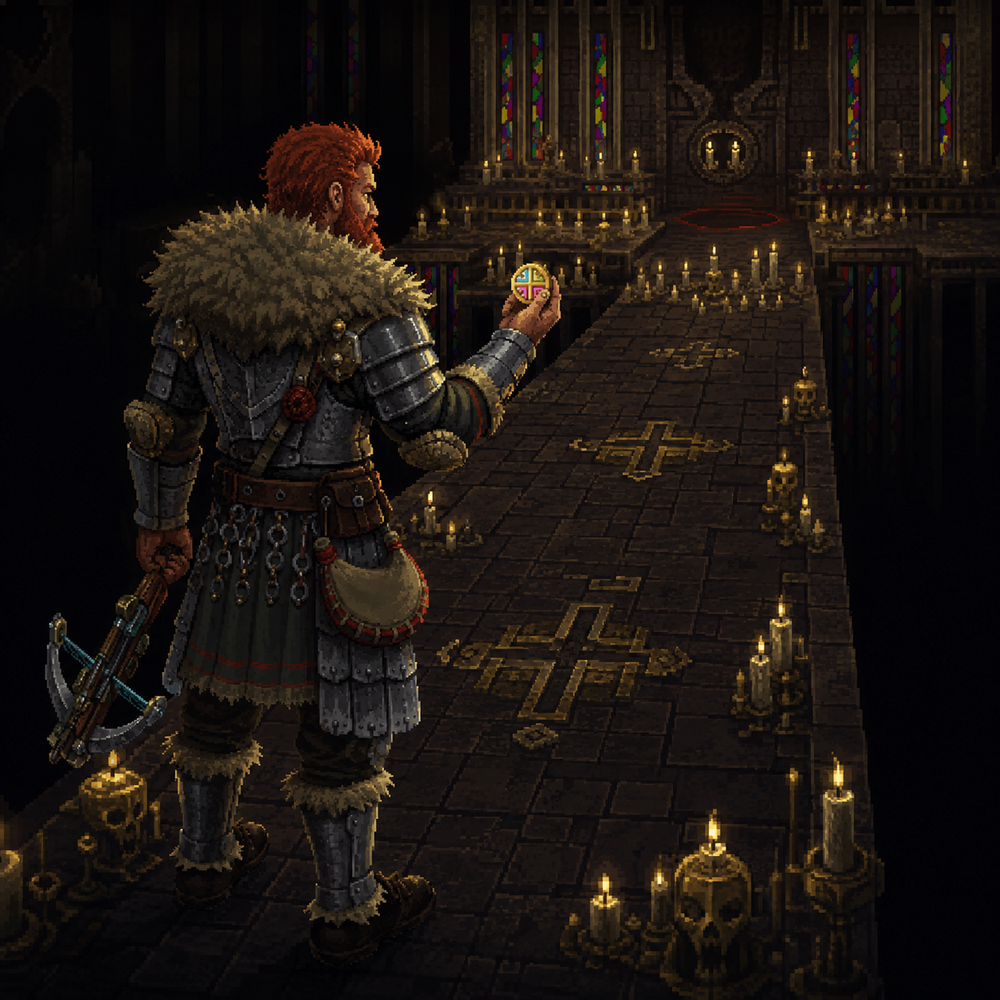

# 战士通关精选插画

本目录收录用户挑选并压缩的 **5 张 PNG**，全部为 **1:1、1254×1254**，总大小 **4,616,428 字节（约 4.40 MiB）**。图片使用按场景命名的英文文件名，保留用户提供的图片内容。

插画由 imagegen 内置工具生成，参考本仓库的真实游戏素材，按本次战士／角斗士通关经历作艺术化演绎。画面构图、比例和部分视觉效果不等同于精确地图或游戏截图。

## 文件与提示词

[prompts.json](prompts.json) 按当前文件名保存每张图片的信息：

- **file、title、floor**：当前文件名、中文标题和对应地牢层数。
- **width、height、bytes、format**：压缩图片的实测尺寸、大小与格式。
- **prompt**：完整英文生成提示词，包含环境、角色、构图和额外约束。
- **refs**：相对于仓库根目录的真实素材路径；数组顺序与提示词中的参考图编号一致。

| 文件 | 层数 | 标题 | 大小（字节） |
|---|---:|---|---:|
| [goo-retreat.png](goo-retreat.png) | 5 | 看懂那一下 | 1,057,437 |
| [dm300-pylon-run.png](dm300-pylon-run.png) | 15 | 超载以后，目标在远处 | 863,692 |
| [scorpio-time-freeze.png](scorpio-time-freeze.png) | 23 | 蝎影中的停顿 | 977,895 |
| [rusted-fist-duel.png](rusted-fist-duel.png) | 25 | 碎铁如雨 | 877,764 |
| [yendor-victory.png](yendor-victory.png) | 26 | 到此为止，也已足够 | 839,640 |

## 图片预览

### 看懂那一下

第 5 层，仍穿皮甲、手持短柄手斧的战士识别粘咕蓄力，退向门边，在潮湿下水道中保持距离。

### 超载以后，目标在远处

第 15 层，DM-300 超载后，鳞甲战士持弩沿干燥石路转移，避开通电水道，奔向提供能量的电塔。

### 蝎影中的停顿

第 23 层，战士借沙漏冻结时间，在门口用盲草与液火药水对付酸液蝎子。镜头从蝎子一侧望向门口，让悬停的瓶片与药液表现冻结的一刻。

### 碎铁如雨

第 25 层，把锈拳引出尤格的保护范围，在红色浅水中迎击。寒光、裂纹与落下的铁屑表现暴雨连击的延迟伤害；这里的红色液体是游戏中不灼烧角色的低温岩浆／水地形。

### 到此为止，也已足够

第 26 层，取得 Yendor 护符的角斗士停在烛光长廊。掌心里的四色护符、身旁的寒冷十字弩与深渊石道，记录这次取得护符后结束的普通胜利。

## 参考素材

素材已包含在本仓库中，按每张图片的 refs 顺序与对应完整提示词一起使用。原始素材及项目授权说明见仓库根目录。

- [core/src/main/assets/environment/custom_tiles/halls_special.png](../../../core/src/main/assets/environment/custom_tiles/halls_special.png)
- [core/src/main/assets/environment/tiles_caves.png](../../../core/src/main/assets/environment/tiles_caves.png)
- [core/src/main/assets/environment/tiles_halls.png](../../../core/src/main/assets/environment/tiles_halls.png)
- [core/src/main/assets/splashes/halls.jpg](../../../core/src/main/assets/splashes/halls.jpg)
- [core/src/main/assets/splashes/sewers.jpg](../../../core/src/main/assets/splashes/sewers.jpg)
- [core/src/main/assets/splashes/warrior.jpg](../../../core/src/main/assets/splashes/warrior.jpg)
- [core/src/main/assets/sprites/amulet.png](../../../core/src/main/assets/sprites/amulet.png)
- [core/src/main/assets/sprites/dm300.png](../../../core/src/main/assets/sprites/dm300.png)
- [core/src/main/assets/sprites/goo.png](../../../core/src/main/assets/sprites/goo.png)
- [core/src/main/assets/sprites/items.png](../../../core/src/main/assets/sprites/items.png)
- [core/src/main/assets/sprites/pylon.png](../../../core/src/main/assets/sprites/pylon.png)
- [core/src/main/assets/sprites/scorpio.png](../../../core/src/main/assets/sprites/scorpio.png)
- [core/src/main/assets/sprites/warrior.png](../../../core/src/main/assets/sprites/warrior.png)
- [core/src/main/assets/sprites/yog.png](../../../core/src/main/assets/sprites/yog.png)
- [core/src/main/assets/sprites/yog_fists.png](../../../core/src/main/assets/sprites/yog_fists.png)

[返回通关归档与文件清单](../README.md)
